# RIME 配置小工具

> 快速采集、配置、调整并长期维护属于自己的个人 Rime 词库。

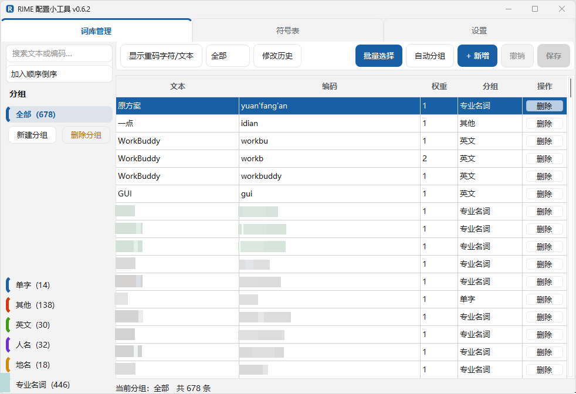

## 为自己的输入习惯，打造一套个人词库

Rime 是一款优秀的本地离线输入法。它轻量、可定制、没有商业广告，词库和配置由用户自己掌控，适合重视输入体验、资源占用和个人数据边界的用户。

Rime 的自定义能力非常强大。它使用可读的文本配置和词库文件，支持方案组合、版本管理、脚本化维护和深度定制，因此尤其适合程序员、技术人员，以及希望掌控输入法行为的进阶用户。

但本地输入法也有天然的取舍：它没有大型商业输入法长期积累的云端词库、在线联想和自学习能力。即使使用成熟的 Rime 方案，其基础词库通常仍以公开词库为主；面对个人职业领域、工作环境、常用表达和输入习惯时，候选结果未必总能贴合实际需求。

每个人都会有一套属于自己的词汇：专业术语、项目名称、固定短语、人名地名、常用英文，以及工作和生活中反复输入的内容。它们未必适合进入公共词库，却非常值得沉淀为自己的个人词库。

随着使用时间增长，个人词库会不断积累。那些反复输入的专业术语、固定表达和个人习惯用语逐渐被收录后，输入体验也会越来越贴合自己。个人词库不应是一次性配置，而应当是一项可以长期建设、持续优化的个人资产。

## 为什么需要这个工具

Rime 本身缺少面向日常维护的图形化配置界面。很多人希望快速完成具体任务，而不是先了解和掌握输入方案的机制与原理。这种门槛可能也是 Rime 目前仍属于偏小众输入法的原因之一。

RIME 配置小工具最初也是为解决这一痛点而开发。它尝试为个人词库维护建立一个直观的图形化配置界面，在保留 Rime 本地化、可控和强大定制能力的同时，把高频的个人词库维护操作变得更容易理解和使用。

工具将“发现一个常用词”到“它按合适的编码和候选位置出现在输入法中”的过程，尽量缩短为一次采集、确认和保存；再通过多编码、权重、候选预览、重码管理、分组、批量操作、备份恢复等能力，让个人词库可以长期积累，而不必频繁手工编辑 Rime 配置文件。

## 从选中文字到个人词库

在工作、浏览或阅读时，用鼠标选中希望收入个人词库的字词。无论是汉字、英文、数字，还是它们的混合组合，只需按下设置好的全局快捷键，即可打开采集窗口并保存到个人词库。

保存后，工具可自动刷新 Rime 部署，使新增词条尽快生效。用户还可以编辑词条权重，控制它在相同编码候选中的排序位置，让常用内容更容易被优先输入。

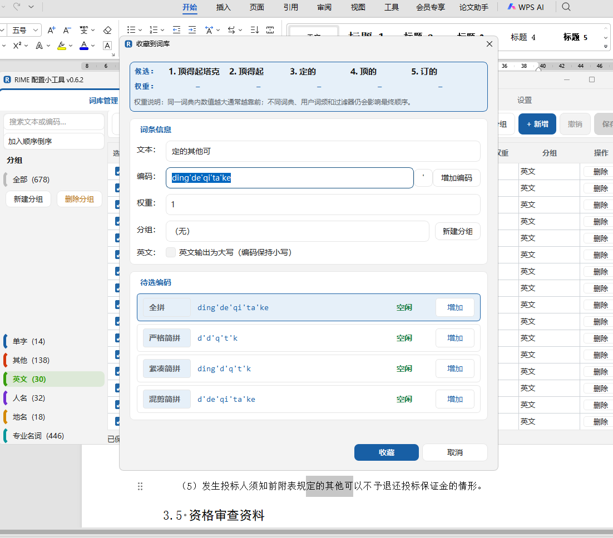

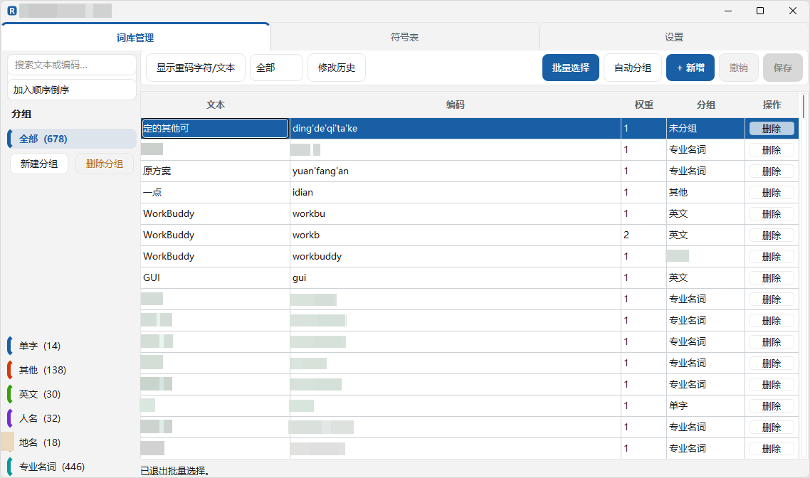

### 候选与权重预览

采集和编辑窗口会显示独立 Rime 会话的前五项候选，以及可读取的系统词典或自定义词权重。当前正在采集或编辑的文本会使用主题强调色标记。候选预览仅用于辅助判断，不会改变正在使用的输入法。

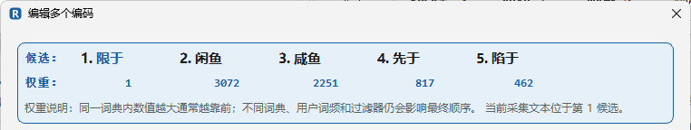

## 主要功能

### 词库管理与批量维护

- 搜索、排序、分组和筛选词条。
- 直接编辑文本、编码和权重。
- 批量选择、批量删除、批量调整分组。
- 分组显示条目数量，便于整理个人词库。
- 提供词库检查、修改历史和导入导出能力。

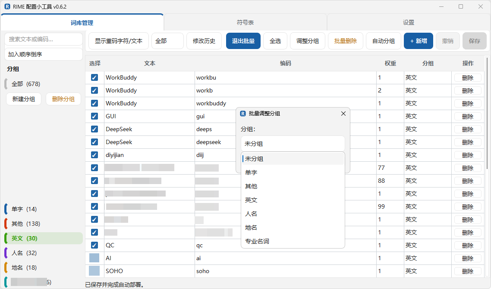

### 多编码维护

同一文本支持多个编码。双击词条可集中维护已有编码，也可从全拼、严格简拼、紧凑简拼和混剪简拼建议中一键加入新编码。

纯英文文本可选择小写、大写或原样编码；英文短语会自动移除空格和连字符，生成连续编码。

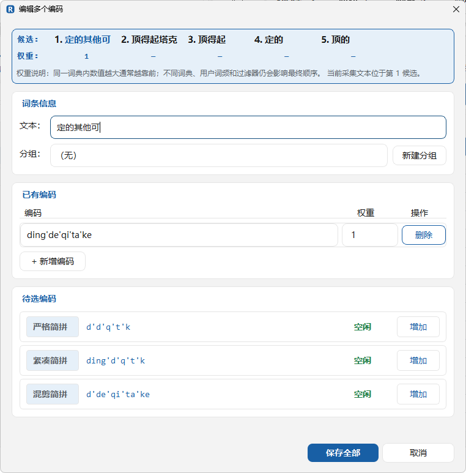

### 重码集中管理

可按“重码文本”或“重码拼音”查看全库冲突。双击项目后，可在二级窗口集中修改文本、编码和权重，或暂存删除项目；点击“保存全部”后才会统一写入词库。

| 按重码文本浏览 | 集中编辑重码文本 |
| --- | --- |
| 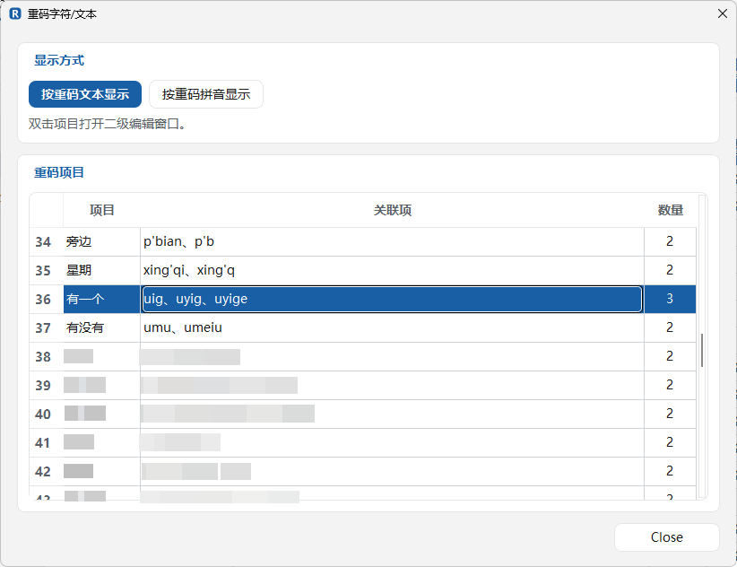 | 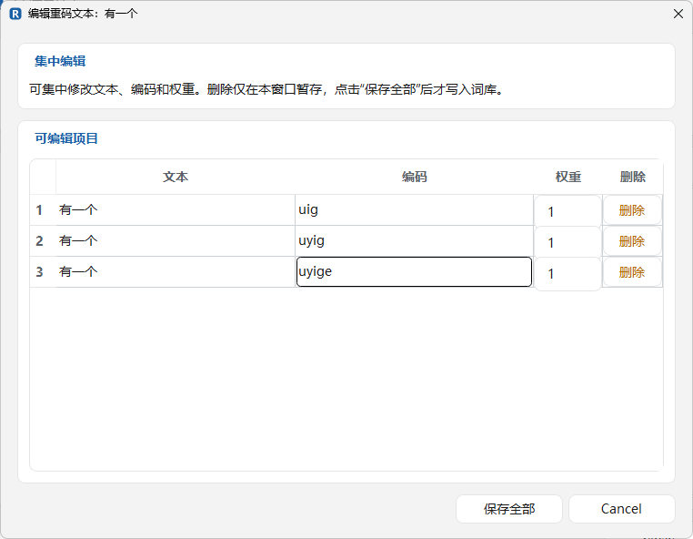 |
| 按重码拼音浏览 | 集中编辑重码拼音 |
| 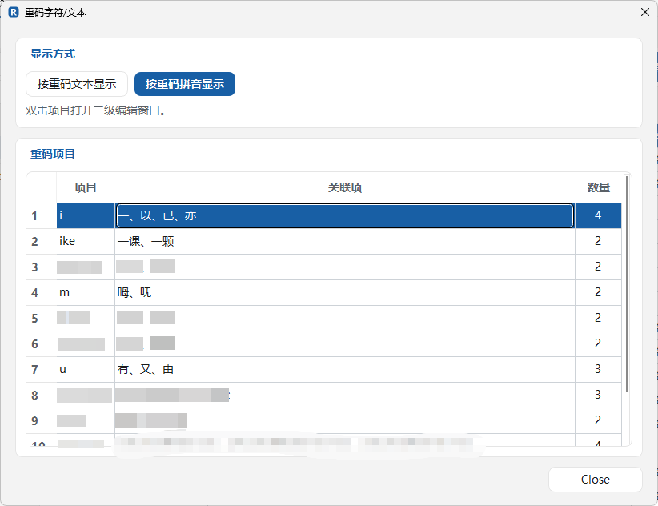 | 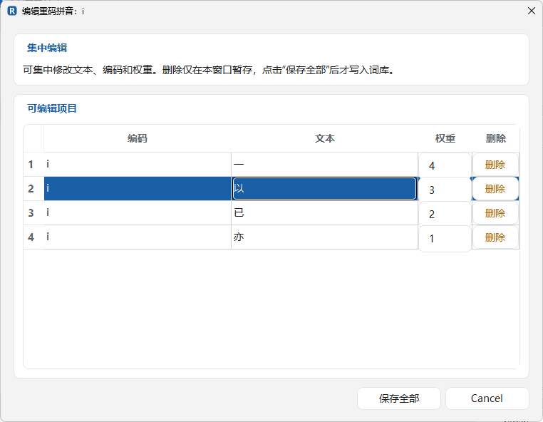 |

### 备份与恢复

- 关键保存前自动备份受管文件。
- 支持立即备份、定期备份、自定义备份周期和保留份数。
- 支持自动清理旧备份，并可直接打开备份文件夹。
- 可选择历史版本恢复词库短语、输入方案和符号表。

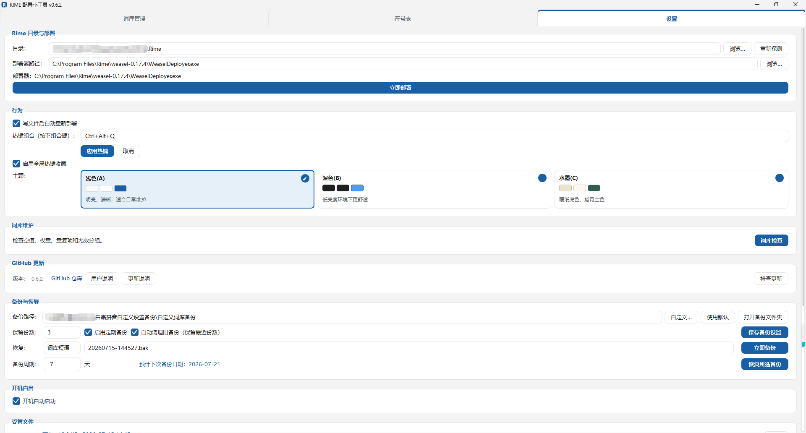

### 托盘、部署与主题

- 系统托盘常驻，关闭窗口后仍可随时打开。
- 支持开机自启、立即重新部署和保存后自动部署。
- 单实例保护：重复启动时会恢复已运行窗口。
- 提供浅色、深色和水墨三种主题。

<p align="center">
  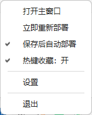
</p>

| 深色主题 | 水墨主题 |
| --- | --- |
| 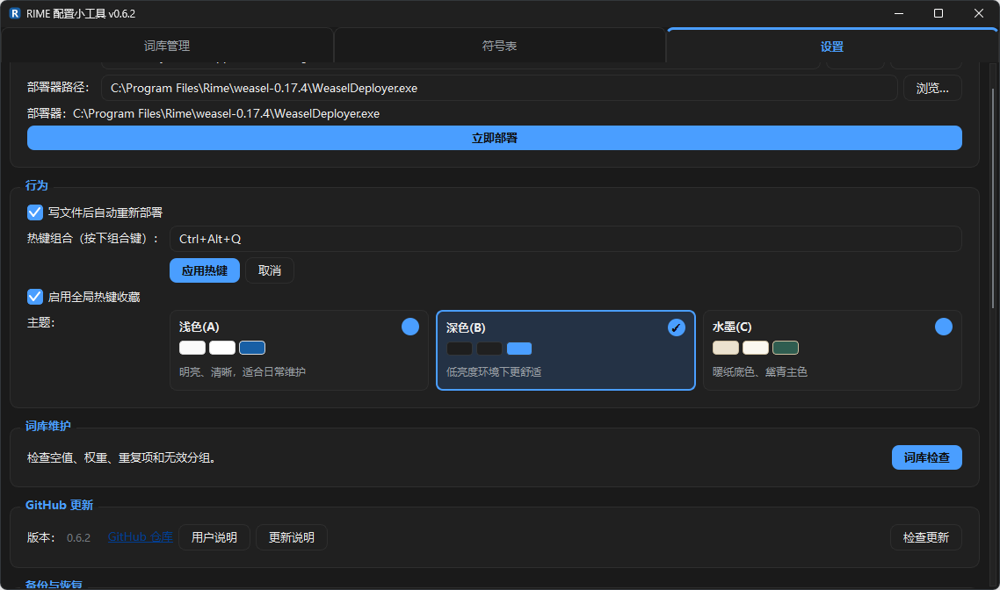 | 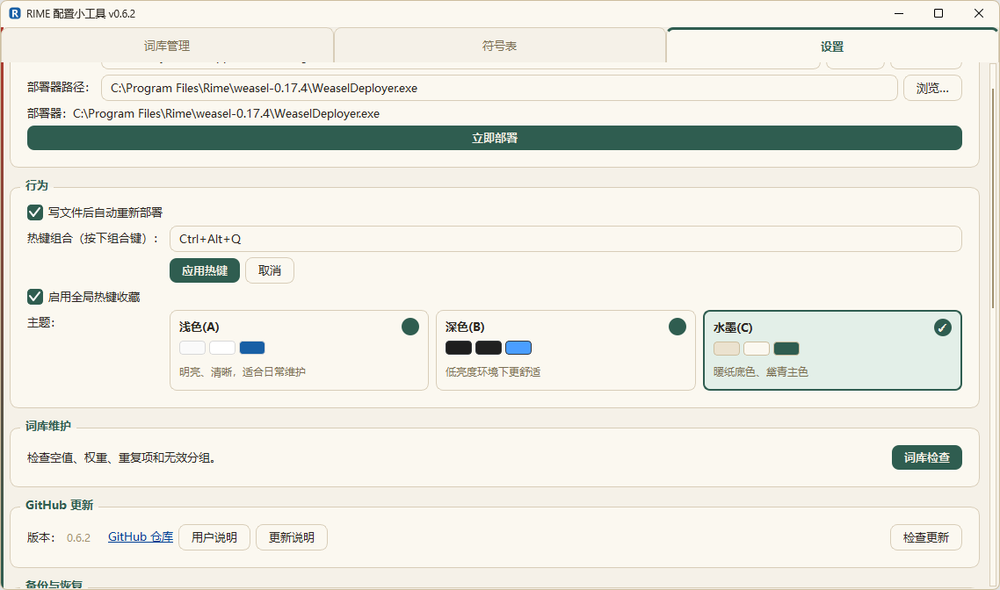 |

## 下载与运行

前往 [GitHub Releases](https://github.com/ysbushe/rime-config-tool/releases/latest) 下载适合自己的 Windows 发布包：

| 文件 | 适用方式 |
| --- | --- |
| `RimeConfig.exe` | 单文件版。无需安装，双击即可运行；支持应用内“检查更新”。 |
| `RimeConfig-portable.zip` | 目录式便携版。解压后运行其中的 `RimeConfig.exe`。 |

程序面向 Windows 10/11 和小狼毫 Rime 用户。首次启动时会自动尝试寻找 Rime 用户目录；未识别时，可在“设置”页面手动选择。

## 基本使用流程

1. 打开“设置”，确认 Rime 用户目录有效。
2. 在“词库管理”中维护已有词条、分组和权重。
3. 在工作或浏览时选中文字，使用全局热键打开采集窗口。
4. 选择合适的编码建议、分组和权重后保存。
5. 根据需要立即部署，或启用保存后自动部署。
6. 使用重码管理、批量操作和备份恢复持续整理词库。

完整使用说明见 [用户说明](docs/USER_GUIDE.md)，历次变更见 [更新记录](docs/RELEASE_NOTES.md)。

## 受管文件

程序主要维护以下 Rime 文件：

- `custom_phrase.txt`：自定义短语、编码和权重。
- `rime_frost.schema.yaml`：输入方案信息与部署检测。
- `symbols_v.yaml`：符号表分类与条目。
- `pinyin_display.ini`：本工具保存的拼音显示分隔信息。

词库仍以 Rime 兼容的 UTF-8 无 BOM、Tab 分隔格式写入：

```text
文本    编码    权重
```

## 开发与测试

```powershell
python -m venv .venv
.\.venv\Scripts\python.exe -m pip install -r requirements-dev.txt
.\.venv\Scripts\python.exe -m pytest -q
.\.venv\Scripts\python.exe -m src.main
```

单文件打包：

```powershell
.\.venv\Scripts\python.exe -m PyInstaller --noconfirm --clean build.spec
```

目录式打包：

```powershell
.\.venv\Scripts\python.exe -m PyInstaller --noconfirm --clean RimeConfig-dir.spec
```

## 版本与说明

当前版本：`v0.6.2`

- [用户说明](docs/USER_GUIDE.md)
- [更新记录](docs/RELEASE_NOTES.md)
- [GitHub Releases](https://github.com/ysbushe/rime-config-tool/releases/latest)
